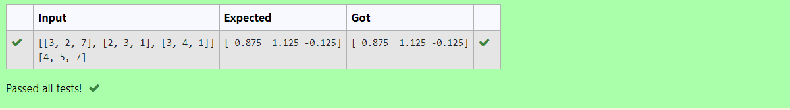
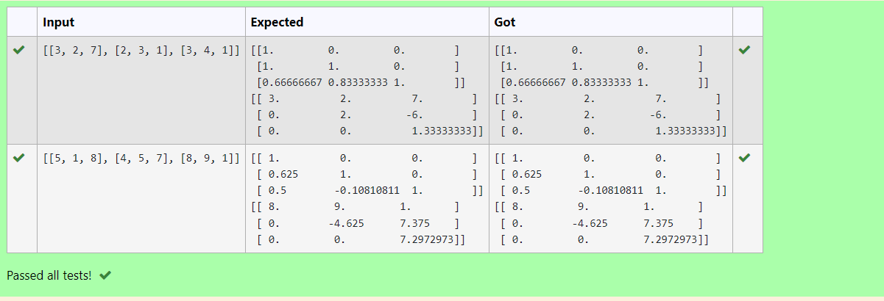

# LU Decomposition 

## AIM:
To write a program to find the LU Decomposition of a matrix.

## Equipments Required:
1. Hardware – PCs
2. Anaconda – Python 3.7 Installation / Moodle-Code Runner

## Algorithm
1.Import numpy library 
2.From scipy.linalg import lu,lu_fator,lu_solve
3.Fine the L and U matrix using the lu() function
4.Find the LU decomposition of the matrix using lu_factor and lu_solve
5.End the program
## Program:
(i) To find the L and U matrix
```python
'''
Program to find the L and U matrix.
Developed by:A.J.PRANAV
RegisterNumber:22008772 
'''
import numpy as np
from scipy.linalg import lu
A=np.array(eval(input()))
P,L,U=lu(A)
print(L)
print(U)
```
(ii) To find the LU Decomposition of a matrix
```python
'''
Program to find the LU Decomposition of a matrix.
Developed by:A.J.PRANAV
RegisterNumber:22008772 
'''
import numpy as np
from scipy.linalg import lu_factor,lu_solve
A=np.array(eval(input()))
b=np.array(eval(input()))
lu,piv=lu_factor(A)
x=lu_solve((lu,piv),b)
print(x)
```

## Output:




## Result:
Thus the program to find the LU Decomposition of a matrix is written and verified using python programming.

